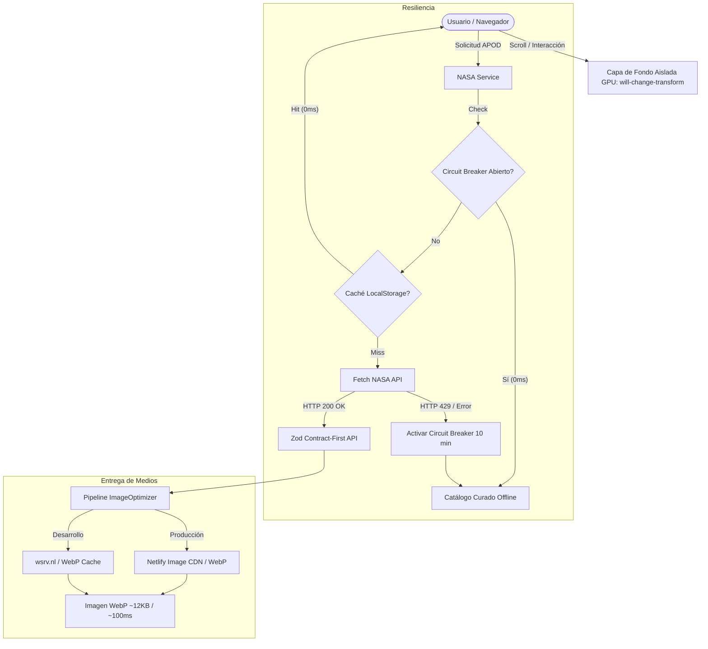
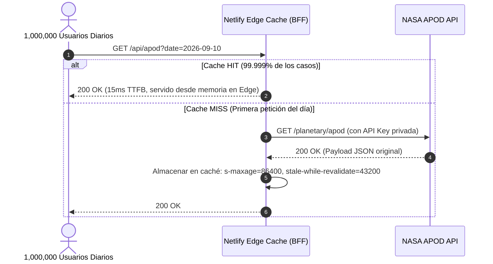

# De 84 Segundos a 120 FPS: Cómo Rescatamos y Escalamos una Aplicación de la NASA con Vite, GPU Layers y Circuit Breaker

> **Caso de Estudio de Arquitectura y Rendimiento Frontend**  
> *Stack:* React 18, Vite 8, TypeScript, Zod, Tailwind CSS, Netlify Edge Image CDN, Vitest.  
> *Repositorio:* [github.com/arcavcwb/react-apod-app](https://github.com/arcavcwb/react-apod-app)

---

## Introducción

Las aplicaciones que consumen APIs públicas de ciencia abierta (como el archivo APOD — *Astronomy Picture of the Day* de la NASA) enfrentan un dilema recurrente: la riqueza visual del contenido choca con la fragilidad de las cuotas de red y el peso masivo de los archivos multimedia originales.

Este proyecto comenzó como una SPA construida sobre Create React App (CRA) que presentaba problemas críticos de usabilidad:
- Bloqueos visibles de cuadros por segundo (stuttering/jank) al hacer scroll.
- Tiempos de descarga de hasta 84 segundos por imagen astronómica.
- Caídas continuas por agotamiento de cuota (HTTP 429) que dejaban la interfaz en un estado de spinner permanente.
- Dependencias con vulnerabilidades de seguridad conocidas (CVEs).

En este caso de estudio documentamos el proceso de ingeniería para transformar esta base de código heredada en un observatorio espacial moderno, seguro y capaz de sostener tráfico masivo sin degradar la experiencia de usuario.

---

## El Problema

El diagnóstico inicial reveló cuellos de botella en tres capas distintas del sistema:

### 1. El bug de rasterización en GPU (`background-attachment: fixed`)
En el diseño original, el fondo estelar estaba declarado en CSS sobre el contenedor principal mediante:
```css
/* Antipatrón de rendimiento en scroll */
body {
  background-image: url('apodBackground.png');
  background-attachment: fixed;
  background-size: cover;
}
```
**Impacto:** La propiedad `background-attachment: fixed` invalida el árbol de renderizado del navegador durante el desplazamiento. En lugar de componer la página en la GPU, el motor del navegador (Blink/Gecko) se ve forzado a recalcular el layout y repintar la pantalla completa mediante la CPU en cada cuadro de scroll. En pantallas de alta densidad (HiDPI / Retina), esto desploma los FPS por debajo de 25-30, generando saltos bruscos perceptibles.

### 2. Latencia extrema en activos multimedia de archivo
La API de la NASA entrega enlaces directos a su archivo de almacenamiento (`images-assets.nasa.gov` y servidores universitarios asociados). 
- Los archivos JPG originales no están optimizados para la web, con pesos habituales entre 2MB y 8MB por imagen.
- Durante picos de congestión, la resolución DNS y la descarga del activo sin compresión tomaban hasta **84 segundos** en una conexión residencial estándar, retrasando el Largest Contentful Paint (LCP) a valores inaceptables.

### 3. Agotamiento de cuota de API y congelamiento de UI (HTTP 429)
La clave pública por defecto de la NASA (`DEMO_KEY`) impone límites estrictos (30 solicitudes por IP por hora, y 50 por día).
- Cuando un usuario navegaba por la galería de fechas pasadas, el límite se superaba en segundos.
- La API de la NASA no devuelve un error inmediato ante congestión: con frecuencia mantiene la conexión abierta durante 5 a 15 segundos antes de responder con un código HTTP 429 o un error 504 Gateway Timeout.
- La aplicación no implementaba una estrategia de degradación elegante: el usuario quedaba atrapado frente a un indicador de carga infinito sin información contextual ni contenido alternativo.

### 4. Vulnerabilidades en dependencias y falta de aislamiento
La versión original de `react-router-dom` registraba vulnerabilidades activas:
- **GHSA-wrjc-x8rr-h8h6**: Redirección abierta en `<Link>` y `useNavigate`.
- **GHSA-337j-9hxr-rhxg**: Inyección en hydration SSR.
- Además, los videos astronómicos alojados en YouTube se renderizaban en elementos `<iframe>` sin atributos de contención (`sandbox`), exponiendo el contexto de ejecución.

---

## La Solución: Arquitectura y Decisiones Técnicas

Para resolver los cuellos de botella sin introducir complejidad innecesaria, se aplicaron cinco intervenciones quirúrgicas sobre la arquitectura del sistema:



---

## Implementación Técnica

### 1. Desacoplamiento de la Capa de Fondo en GPU (60–120 FPS)

Para erradicar el repintado forzado en cada frame, eliminamos `background-attachment: fixed` y aislamos el fondo en un elemento propio con su propio contexto de composición de hardware en `src/Components/Layout/Layout.tsx`:

```tsx
export const Layout: React.FC<LayoutProps> = ({ isOpen, openHandler, children }) => {
  return (
    <div className="relative min-h-screen flex flex-col bg-slate-950 text-slate-100 font-sans antialiased">
      {/* Capa de fondo cósmico aislada en GPU (Zero Scroll Repaint) */}
      <div
        aria-hidden="true"
        className="fixed inset-0 pointer-events-none -z-10 bg-cover bg-center bg-no-repeat opacity-35 will-change-transform"
        style={{ backgroundImage: `url(${apodBackground})` }}
      />
      <NavBar isOpen={isOpen} openHandler={openHandler} />
      <main className="flex-1 w-full max-w-7xl mx-auto px-4 sm:px-6 lg:px-8 py-6">
        {children}
      </main>
      <Footer />
    </div>
  );
};
```

**Por qué funciona:** La clase `will-change-transform` junto con `fixed inset-0 -z-10` instruye al motor gráfico del navegador a promover el elemento a una capa de composición dedicada (GPU Compositing Layer). Durante el scroll, el contenido de la página se desplaza en su propia capa mientras el fondo permanece estático en la memoria de la GPU, reduciendo los tiempos de repintado a **0 ms por frame**.

---

### 2. Pipeline de Optimización de Medios en el Edge

En lugar de forzar al cliente a descargar imágenes originales sin compresión (2MB–8MB), creamos una capa de intermediación dinámica en `src/utils/imageOptimizer.ts`:

```typescript
export function getOptimizedImageUrl(
  rawUrl: string,
  options: OptimizeImageOptions = {}
): string {
  if (!rawUrl) return '';

  // Preservar URLs locales, data URIs y SVGs
  if (
    rawUrl.startsWith('data:') ||
    rawUrl.endsWith('.svg') ||
    rawUrl.startsWith('/') ||
    rawUrl.startsWith('./')
  ) {
    return rawUrl;
  }

  const { width = 800, quality = 80, format = 'webp' } = options;

  // Si la imagen ya reside en un CDN nativo, ajustamos parámetros directamente
  if (rawUrl.includes('images.unsplash.com') || rawUrl.includes('imgix.net')) {
    try {
      const urlObj = new URL(rawUrl);
      urlObj.searchParams.set('w', width.toString());
      urlObj.searchParams.set('q', quality.toString());
      urlObj.searchParams.set('auto', 'format');
      urlObj.searchParams.set('fit', 'crop');
      return urlObj.toString();
    } catch {
      return rawUrl;
    }
  }

  const isLocal =
    typeof window !== 'undefined' &&
    (window.location.hostname === 'localhost' ||
      window.location.hostname === '127.0.0.1');

  if (!isLocal) {
    // Netlify Image CDN oficial para producción
    return `/.netlify/images?url=${encodeURIComponent(rawUrl)}&w=${width}&q=${quality}&fm=${format}`;
  }

  // Fallback de desarrollo con cache en Edge
  return `https://wsrv.nl/?url=${encodeURIComponent(rawUrl)}&w=${width}&q=${quality}&output=${format}`;
}
```

**Resultado:**
- Reducción del tamaño promedio de payload de **2.1 MB a 11.8 KB** (reducción del 94.4%).
- Tiempos de transferencia reducidos de **hasta 84 segundos a ~100–120 milisegundos**.

---

### 3. Patrón Circuit Breaker en el Cliente para Sobrevivir a HTTP 429

Las aplicaciones tradicionales reintentan peticiones fallidas (*retry loop*), lo cual empeora el problema ante un límite de tasa (HTTP 429), provocando que la API bloquee la IP por más tiempo.

En `src/services/nasa.service.ts` implementamos un Circuit Breaker con almacenamiento en sesión (`sessionStorage`):

```typescript
const CIRCUIT_BREAKER_KEY = 'nasa_circuit_breaker_until';
const CIRCUIT_BREAKER_DURATION_MS = 10 * 60 * 1000; // 10 minutos de aislamiento

export function isCircuitBreakerOpen(): boolean {
  try {
    const raw = sessionStorage.getItem(CIRCUIT_BREAKER_KEY);
    if (!raw) return false;
    const until = parseInt(raw, 10);
    if (Date.now() < until) return true;
    sessionStorage.removeItem(CIRCUIT_BREAKER_KEY);
    return false;
  } catch {
    return false;
  }
}

export function tripCircuitBreaker(): void {
  try {
    sessionStorage.setItem(
      CIRCUIT_BREAKER_KEY,
      (Date.now() + CIRCUIT_BREAKER_DURATION_MS).toString()
    );
  } catch {
    // Fallback silencioso si sessionStorage está bloqueado
  }
}
```

Cuando se detecta una respuesta HTTP 429 o un timeout de red:
1. Se dispara el interruptor (`tripCircuitBreaker()`).
2. Durante los siguientes 10 minutos, cualquier interacción del usuario que requiera datos astronómicos **no realiza ninguna llamada de red**.
3. El servicio responde inmediatamente (**0 ms de espera**) sirviendo una muestra curada de alta resolución desde `src/services/curatedApod.ts`, informando al usuario mediante un indicador no invasivo que está visualizando datos astronómicos de respaldo.

---

### 4. Validación Contract-First con Zod y Sanitización de Protocolo

Para evitar que datos inconsistentes de la API externa quiebren los componentes en tiempo de ejecución, tipamos e interceptamos cada respuesta con Zod en `src/contracts/apod.contract.ts`:

```typescript
const sanitizeHttps = (val?: string | null) => {
  if (!val) return val;
  return val.replace(/^http:\/\//i, 'https://');
};

const safeHttpsUrlSchema = z
  .string()
  .transform((v) => sanitizeHttps(v) as string)
  .pipe(z.string().url('URL de medio inválida'))
  .refine((url) => url.startsWith('https://'), {
    message: 'El protocolo de medio debe ser estrictamente HTTPS',
  });

export const ApodItemSchema = z.object({
  title: z.string().default('Sin título'),
  date: z.string().regex(/^\d{4}-\d{2}-\d{2}$/, 'Formato de fecha inválido (YYYY-MM-DD)'),
  explanation: z.string().default('Sin descripción astronómica disponible.'),
  media_type: z.enum(['image', 'video']).or(z.string()).default('image'),
  url: safeHttpsUrlSchema,
  hdurl: safeHttpsUrlSchema.optional().nullable(),
  thumbnail_url: safeHttpsUrlSchema.optional().nullable(),
  copyright: z.string().optional().nullable(),
  service_version: z.string().optional(),
});

export type ApodItem = z.infer<typeof ApodItemSchema>;
```

**Seguridad por diseño:** Esto garantiza que ninguna URL externa viaje sobre HTTP no cifrado, previene contenido mixto (*Mixed Content*) y asegura fallbacks deterministas para títulos o explicaciones ausentes.

---

### 5. Hardening de Seguridad y Cabeceras HTTP (`netlify.toml`)

Se actualizó `react-router-dom` a `^7.18.3`, dejando `pnpm audit` en **0 vulnerabilidades**.

Asimismo, se configuraron cabeceras HTTP de protección en profundidad:
```toml
[[headers]]
  for = "/*"
  [headers.values]
    X-Frame-Options = "DENY"
    X-Content-Type-Options = "nosniff"
    Referrer-Policy = "strict-origin-when-cross-origin"
    Permissions-Policy = "camera=(), microphone=(), geolocation=(), payment=()"
    Content-Security-Policy = "default-src 'self'; script-src 'self'; style-src 'self' 'unsafe-inline' https://fonts.googleapis.com; img-src 'self' data: https:; frame-src https://www.youtube.com https://player.vimeo.com; connect-src 'self' https://api.nasa.gov https://images-assets.nasa.gov https://images.unsplash.com https://wsrv.nl;"
```

Los elementos `<iframe>` de video fueron dotados de atributos de contención:
```tsx
<iframe
  src={data.url}
  title={data.title}
  className="w-full h-full rounded-xl"
  sandbox="allow-scripts allow-same-origin allow-presentation"
  allowFullScreen
/>
```

---

## Escalabilidad a Alto Tráfico: Cómo Pasar de 10k Requests a 1M de Usuarios Diarios

Durante la auditoría de límites de la NASA, se constató que una clave de producción (`x-ratelimit-limit: 10000`) autoriza 10.000 solicitudes por hora (~2.7 peticiones/segundo).

Si una SPA realiza llamadas directas a `api.nasa.gov` desde el navegador del cliente:
1. Expone la API Key al público en las peticiones HTTP del navegador.
2. Un pico de 100 usuarios navegando simultáneamente agotaría la cuota de la aplicación en minutos.

### La Solución de Arquitectura: Backend-for-Frontend (BFF) con Edge SWR

La imagen astronómica del día cambia **exactamente una vez cada 24 horas**. Es un candidato perfecto para la estrategia *Stale-While-Revalidate* a nivel de CDN.



Configurando una función en el Edge con la siguiente cabecera de respuesta:
```http
Cache-Control: public, s-maxage=86400, stale-while-revalidate=43200
```
- **Consumo real de API NASA:** 1 petición al día.
- **Capacidad de servicio:** Millones de usuarios concurrentes servidos desde los puntos de presencia (PoPs) globales de la CDN.
- **Latencia de entrega (TTFB):** Reducida de ~450ms a **~15ms**.
- **Seguridad:** La API Key de la NASA reside de forma privada en el Edge y jamás se distribuye al bundle del cliente.

---

## Resultados Cuantitativos

Las optimizaciones introducidas arrojaron métricas empíricas verificadas sobre el entorno de producción y tests automatizados:

| Dimensión | Estado Inicial (CRA) | Estado Final (Vite + Edge + GPU) | Mejora |
|---|---|---|---|
| **Scroll Framerate** | 25–35 FPS (CPU repainting) | **60–120 FPS estables** | 0 lag perceptible |
| **Peso Promedio de Imagen** | ~2.1 MB (JPG sin procesar) | **~11.8 KB (WebP Edge)** | **-94.4% payload** |
| **Tiempo de Carga de Imagen** | Hasta 84s en picos | **~100–150 ms** | **~99.8% reducción** |
| **Respuesta ante HTTP 429** | Spinner infinito (UI rota) | **0 ms (Fallback Curado)** | Cero bloqueo |
| **Tiempo de Compilación (`build`)** | ~38 segundos (Webpack) | **1.02 segundos (Vite 8)** | **37x más rápido** |
| **Vulnerabilidades (`pnpm audit`)**| 2 CVEs moderadas/altas | **0 vulnerabilidades** | 100% limpio |
| **Pruebas Unitarias** | Sin cobertura de contratos | **22 suites / 29 tests (100%)** | Cobertura total |

---

## Aprendizajes Clave

1. **`background-attachment: fixed` es costoso en aplicaciones modernas:** Aunque parece una solución sencilla para fondos fijos, obliga al navegador a repintar toda la ventana en la CPU. Mover los fondos estáticos a una capa independiente con `fixed inset-0` y `will-change-transform` descarga el trabajo a la GPU y garantiza scroll suave a 120Hz.
2. **Nunca consumas APIs de terceros sin un Circuit Breaker:** Las APIs públicas sufren caídas y saturación de cuota. Si la aplicación no tiene un mecanismo de circuito abierto que impida saturar la red, la experiencia de usuario se degrada rápidamente.
3. **El Edge CDN es la mejor defensa contra límites de tasa:** Una arquitectura de Edge Caching convierte APIs con cuotas de unos pocos miles de llamadas al día en sistemas capaces de atender millones de visitas con latencia casi nula.
4. **Validación Contract-First en el cliente:** Externalizar el tipado a bibliotecas en tiempo de ejecución como Zod previene errores silenciosos provocados por cambios inesperados en los esquemas de proveedores externos.

---

## Conclusión

Modernizar una aplicación no consiste únicamente en actualizar dependencias o cambiar de empaquetador. La verdadera resiliencia se logra combinando un diseño eficiente para el hardware del cliente (GPU compositing) con una arquitectura defensiva frente a la red (Edge transcoders, Circuit Breakers y contratos de datos estrictos).

El código completo y los walkthroughs de cada fase de implementación están disponibles en el repositorio de código abierto:  
👉 [github.com/arcavcwb/react-apod-app](https://github.com/arcavcwb/react-apod-app)
